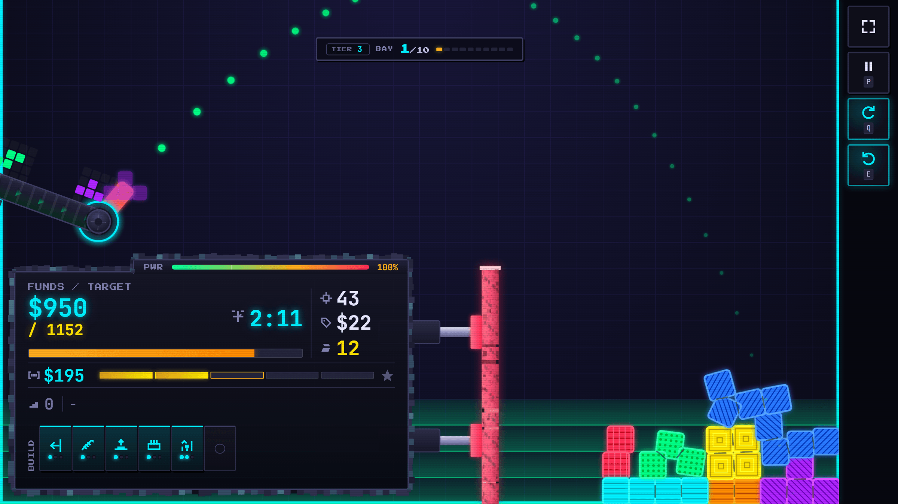
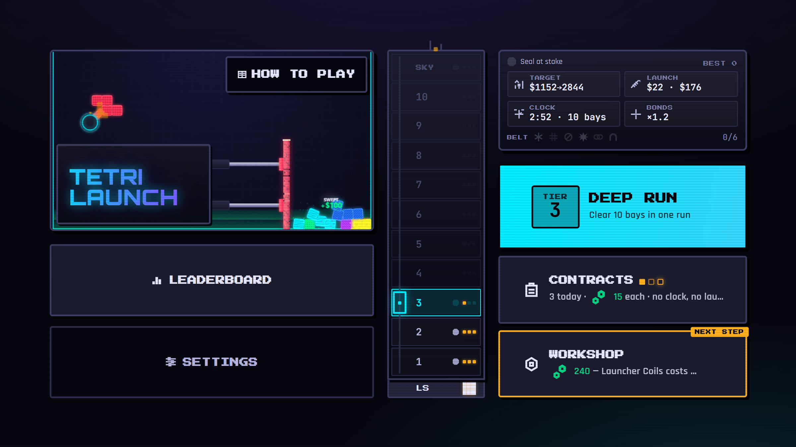
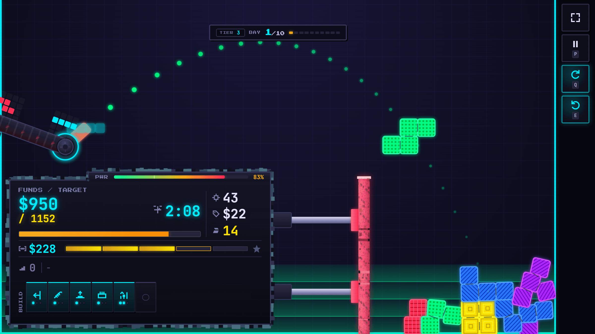
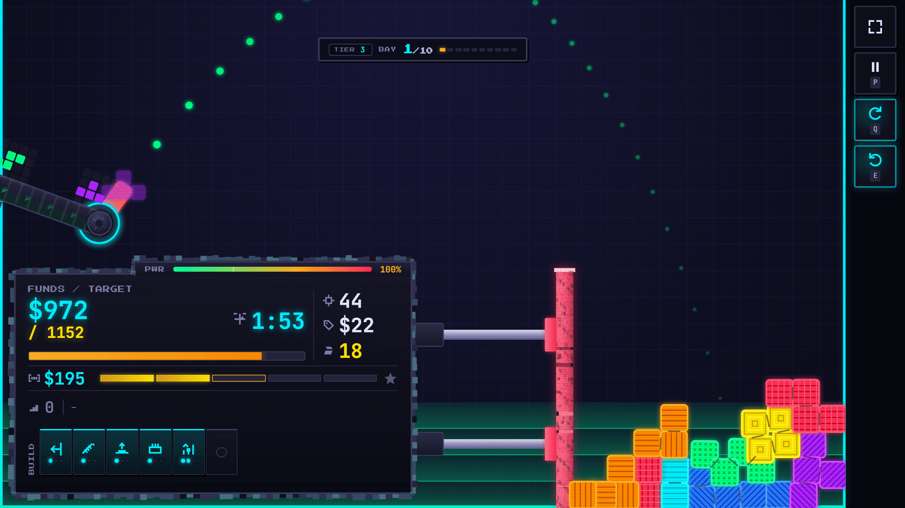
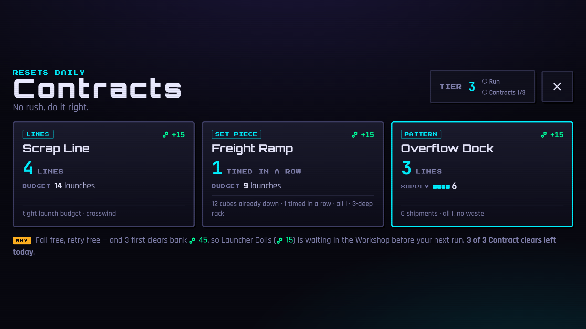
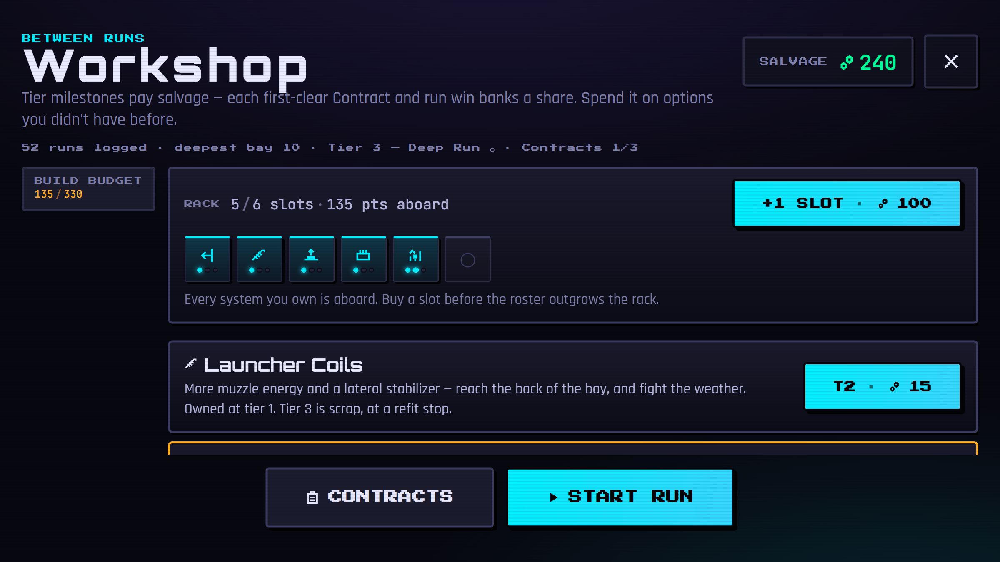

# Tetrilaunch 🚀

A neon-arcade **physics cannon puzzle**. Load the cannon, arc tetrominoes across the bay
with an Angry-Birds-style drag, and feed full rows into the sweeping compactor before it
clears them away.

**Play:** https://tetrilaunch.com/ · [about page](https://tetrilaunch.com/about)
(workers.dev fallback: https://tetrilaunch.venetanji.workers.dev/) · current release **v1.0.6**



> The game began as a Python/pygame prototype (`design/prototype/main.py`, kept for
> reference) and is now a **Capacitor** app targeting **Web (PWA) · Android · iOS ·
> Desktop (Electron, Steam-bound)**, served from **Cloudflare Workers** with a
> **D1-backed leaderboard**.

## 📸 Screenshots

<table>
<tr>
<td width="50%"><br><sub><b>The tower.</b> One floor per Tier, the Skydeck on the roof, and the tier hub holding the run, today's Contracts and the Workshop.</sub></td>
<td width="50%"><br><sub><b>A bay in flight.</b> Funds against the bay's target, the shift clock, the spill fine, and the build rack along the bottom.</sub></td>
</tr>
<tr>
<td width="50%"><br><sub><b>The pile.</b> The compactor ping-pongs against the right wall; a row pays only when every slot is filled by a settled, squared-up cube.</sub></td>
<td width="50%"><br><sub><b>Contracts.</b> Three a day from a shared seed — a lines job, a set piece and a zero-waste pattern — no clock, no launch cost, free to fail.</sub></td>
</tr>
<tr>
<td colspan="2"><br><sub><b>The Workshop.</b> Salvage buys permanent systems — and rack slots, because you can own more systems than you can take aboard.</sub></td>
</tr>
</table>

These are the shipped build's own frames, regenerated by the promo harness
(`npm run promo:shots`, see [`app/sim/promo/`](app/sim/promo/)); the same harness
produces the store listings' screenshots in `store/`.

## 🎮 How it plays

**Four ways in, one verb.** Every mode fires the same cannon at the same compactor;
what changes is what's at stake.

| | what it is | costs | pays |
|---|---|---|---|
| **Flight School** | the licence — one authored bay per idea, in order | nothing | the licence, and a little salvage |
| **Deep Run** | the exam: 10 bays, permadeath, a Tier's terms | a run | the next Tier, salvage, a board place |
| **Contracts** | three generated one-bay jobs a day | nothing | 15 salvage per first clear |
| **Skydeck** | the day's run, one rung past the ladder, nobody's own difficulty | a run | its own daily board |

Plus **Tier S**, the sandbox — see below.

### The bay

- **Drag to aim** — direction sets the launch angle, distance sets the power. A
  dotted **parabola** previews the flight; release to fire. The **ceiling is open**,
  so max-power lobs arc above the screen and fall back in.
- The **compactor** (bottom-half red bar) ping-pongs between its open and
  full-advance stops, pressing cubes against the right wall. A row clears only
  when **every cell slot is filled by one settled, squared-up cube**; the pressing
  stroke grinds near-aligned cubes onto the grid. Cubes that bounce back out blink
  away and are **fined per cube** — $1 a cube on a Tier 1 bay, up to $25 + $2/bay at
  Tier 10, so a spilled pentomino at the top of the ladder is a real wound.
- **A row is graded on when you closed it**, not just that you did:
  **excellent ×1.5 · good ×1.2 · swept ×1 · lucky ×0.7** (`grades.ts`). Threading a
  shipment into a gap and letting a collapsed pile resolve itself used to sell for the
  same money; they don't any more, which is what stops "stack and wait" being the
  dominant late-game play.
- **A congested bay taxes you four ways at once** (`level.ts`'s `PILE_TIERS`): the
  launch costs more, the reload slows, the combo breaks on the way in, and the payout
  multiplier takes a quarter or a half off the sale.
- **Shipments come in three sizes**, and size changes weight and rigidity as well
  as shape. **Micro** dominoes are cheap, precise and brittle — but too light for
  their own weight to square up the pile below them. **Bulk** pentominoes are
  expensive, rigid, and heavy enough that landing presses the layers beneath them
  flat. Standard tetrominoes sit between.
- **Demolition charges** are armed consumables fired by your next launch: they
  cost the full launch fee, and each cube they vaporize **refunds $8** — a
  charge pays for itself from three cubes up. Blowing up a junk pile that will
  never complete a line is a positive-value play; blowing up a row you were two
  cubes from closing is not.
- **The bay settles before it ends.** Cross the funding target and launches stop,
  but the world keeps running: shots already in the air land, and a line your last
  shot completed still gets its pressing stroke and pays out. Then the bay
  celebrates.
- **The HUD tells you when to worry.** Launches-left turns red and pulses at 3 or
  fewer; the reload shows as a bar in the plant and a ring around the muzzle; the
  wind gauge shows the live gust, your stabilizer's cut, and (with the Weather
  Survey unlock) the bay's steady prevailing wind.

### The run, and the Tier ladder

- **A run is 10 bays** of rising difficulty — stiffer joints, a faster compactor, a
  heavier **funding target** every bay. The **countdown** and the price of a shot are
  the **Tier's** knobs, not the bay's: both are set before you launch and stay flat
  all ten bays (only a difficulty axis you ratchet yourself moves them mid-run). Bank
  each bay's target before the clock or the bankroll runs out.
- **Ten Tiers** are the difficulty ladder over the run. Each one states harder terms
  and hands you a larger **build budget** to meet them (`level.ts`, `upgrades.ts`):

  | | Tier 1 | Tier 10 |
  |---|---|---|
  | opening bay's target | $1080 | $1544 |
  | last bay's target | $2700 | $3683 |
  | shift clock | 180s | 144s |
  | a shot | $20 | $30 |
  | opening float | $160 (8 shots) | $240 (8 shots) |
  | spill fine, per cube | $1 | $25 → $43 across the run |
  | build budget | 110 | 1100 (a full ship) |

  The float is **eight launches at every Tier** on purpose: the tier prices a shot, it
  doesn't shorten the opening runway. Above Tier 8 a **precision premium** multiplies
  the finished target (+5% a rung), which is why the top of the table jumps.
- The Tier you may attempt is always **one above your best clear**. Nothing purchasable
  raises it — a Tier is *won*, never bought, which is what keeps "cleared Tier 7" worth
  the same for everyone. **Every Tier keeps its own leaderboard**, so a heavier Tier
  can't out-score a lighter one.
- **Ratchet an axis after every bay** — the between-bay draft deals **2 hazard
  cards** and you must take one (two at Tier 10, `picksPerBay`). There is **no
  skip**: a notch is pure cost — a tighter clock, a dearer shot, a new material
  on the belt — and it sticks for the rest of the run. The reward is bought in
  the **Workshop** and is implicit: a system never deletes a hazard, it makes
  one specific hazard cheap for you. The last draft (after bay 9) deals a
  **Final Inspection** instead: two clauses on the final bay, one of which you
  accept (`finals.ts`).

### The Skydeck

The floor above the ladder, and the one run nobody tunes to their own taste. Its seed
is the Contract board's own day key, so **every player who undocks on the same UTC day
flies the same hazard hands, the same weather, the same belt and the same standing
clauses**. The bays are the target and launch curves read one rung past Tier 10
($1656 → $3933 against $31 a shot). Refit stops still land after bays 3, 6 and 9, but
pay **half** the ladder's scrap, and consumables are never resupplied. It files to its
own board, keyed by the day it was dealt (`BOARD_SKYDECK`, `migrations/0003`).

### Contracts

- **Three free Contract clears per UTC day** — one bay, **no clock, no launch cost**,
  failing costs nothing and you can retry forever. The one-time Full Game purchase adds
  on-demand Contracts and opens earned Tiers 4–10 (the free download is a complete
  three-Tier game, `meta.ts`'s `FREE_TIER_LIMIT`).
- What replaces time and money pressure is a **launch budget**: N shipments to hit the
  goal. The board deals three kinds — a **lines** job, a **set piece** (a pile already
  down, and a shape to finish), and a **pattern** Contract, which instead of a budget
  hands you the *exact* inventory that tiles the goal, so every single cube has to end
  up inside a completed row. **Zero waste.** A backtracking tiler (`tiling.ts`) *proves*
  the queue fills the goal before the Contract ships, because the one failure this mode
  can't survive is an unwinnable puzzle.
- They're generated from a daily seed, so everyone gets the same three.

### Flight School

The licence, and the ground floor of the tower. One authored bay per idea, in an order,
with the HUD block that idea needs arriving on the bay that earns it — aim, then rotate,
then the row, then the timing grade, the streak, the spill fine, the congestion tax.
It replaced a four-card coach riding a live, randomly-dealt Deep Run bay 1, where
everything past the fourth card was met by ambush inside the one mode that can be lost.
Since 1.0.6 it is an **offer, not a gate**: press Play and you can take the lessons or
go straight to Tier 1.

**How to Play is a catalogue, not a briefing.** Every material, axis, ship system,
currency and mode has its own entry (`src/game/guide.ts`), and most of them have a
**drill** attached — a mock bay with no clock and no bankroll that puts that one thing
on the belt and nothing else. A drill banks nothing, costs nothing and can be retried
forever; material drills unlock at the tier whose draft can actually deal that material.

### Three currencies, three horizons

See [docs/ECONOMY.md](docs/ECONOMY.md) for the full rationale.

- **Funds `$`** last one bay. They pay for launches and *are* the bay's target.
- **Scrap `♻`** lasts one run (2/line, 10/bay). Spent on the **ship** at refit stops.
- **Salvage** is forever, banked in equal **15-salvage milestones** — each of
  the current tier's first three Contract clears, plus that tier's run
  win, a flat **60 per tier** — and spent in the **Workshop** on permanent
  unlocks.

### The ship

**The compactor is your ship.** After bays **3, 6 and 9** you dock at a **refit stop**
and spend scrap on **ten systems, three tiers each** (`upgrades.ts`):

| | |
|---|---|
| **Bay Extension** | 12 → 14/16/18 open cells |
| **Launcher Coils** | muzzle power, and a lateral wind stabilizer |
| **Press Hydraulics** | the pressing stroke |
| **Loader Magazine** | reload |
| **Reactor Output** | payout |
| **Bond Emitter** | joint strength |
| **Demolition Rack** | charges |
| **Thaw Lance** | strikes cryo without spending a launch |
| **Impact Cushion** | catches a volatile landing that would otherwise go off |
| **Incinerator** | remits part of a loss bill |

Upgrades last the whole run. The Workshop is where they're **owned** — permanently,
with salvage — and it has a **rack with a limited number of slots**, so a full roster
outgrows what you can take aboard and another slot is itself something to buy. A refit
stop only *raises* tracks the Workshop already installed; it never sells you a new
system mid-run.

### Materials

Eight cube types, and a cube *type* is the content engine — the match-3 trick of getting
a thousand levels out of one verb (`theme.ts`):

**standard** · **slag** (occupies a slot, can never complete a line) · **cryo** (must be
struck before it will compact) · **rebar** (joints never break — denies a *shape* the way
slag denies a *slot*) · **volatile** (detonates on a hard landing, taking its neighbours
with it) · **tar** (welds permanently to whatever it touches) · **magnetic** (snaps itself
square against its neighbours — the one material that helps) · **gold**.

The six hazard materials arrive on the belt through the ratchet draft, one notch at a
time, and each has a drill in How to Play.

### Controls

**Touch/mouse:** drag to aim and fire. On screen, the **Bond Breaker trigger is held for
a second** (a charge meter fills it) rather than tapped: a charge is a run-long
consumable, and a thumb grazing the rail mid-drag must not be able to spend one.

**Keyboard** (all rebindable on the Controls screen, `bindings.ts`):
`W/S` aim · `A/D` power · `Space` fire · `Q/E` rotate · `B` bond breaker ·
`X` arm a demolition charge · `C` thaw lance · `F` **hold** the Autoloader trigger ·
`P` pause (`Esc` pauses too, as a fixed alias — it isn't the primary because every
fullscreen shell eats it before the page sees it).

**Gamepad** is first-class (`gamepad.ts`, `padnav.ts`): the buttons are rebindable,
aim and power live on the left stick, and how the stick speaks is a setting — **rate
dials** by default (a centred stick holds the aim, so the thumb rests between
adjustments) or **slingshot**, where the deflection *is* the drag vector. Menus are
fully pad-navigable, and a DualSense enumerates as `mapping: "standard"` in the desktop
shell.

Landscape only. The field is authored at 1280×720 and **letterboxed by a layout
solver** that adapts to the viewport's aspect ratio and safe-area insets — see
[docs/NATIVE.md](docs/NATIVE.md#display-what-the-layout-solver-does-and-why-native-needed-it).

## 🅢 Tier S — the sandbox

A practice mode, under the tower rather than on it. Tap the beacon on the
headhouse — the blinking lamp on the tower's roof — **nine times in a row** and
a basement floor appears below the building's slab. The elevator does not serve
it; tapping it opens a level-select screen instead.

From there: any Tier 1-10, any of the ten bays started cold, any Contract
variant, any rig from stock to maxed, any belt (one material, or a parade of all
six), and any difficulty axis pre-ratcheted up to three notches — states a real
run can only reach by drafting its way there across six correct bays.

It is a **game mode, not a cheat menu**, and the difference is enforced:

- No salvage, no Tier progress, no step up the ladder — `RunState.sandbox` makes
  `finishRun` skip `recordRunEnd` entirely, and a Tier S Contract never reaches
  `recordContractClear`.
- Scores go to **their own leaderboard** (`BOARD_SANDBOX`), with its own personal
  best. A run started on bay 9 at Tier 10 on a rig nobody paid for can never
  place against an honest one.
- The gesture toggles, and Settings carries the same switch once found.

The **save-editing tools** (set the Tier, grant salvage, unlock everything, wipe)
are a different thing and stay behind the build gate they always had: they live
in `src/lib/sandbox-cheats.ts`, are reached only through `if (SANDBOX)`, and
`npm run verify:store` fails any bundle their marker string appears in. Build one
with `npm run build:sandbox` / `npm run android:apk:sandbox`.

## 🧱 Architecture

```
app/                      Capacitor + Vite + TypeScript web app
  src/game/               matter.js physics port of design/prototype/main.py
    engine, pieces, cannon, compactor, lineClear, render, fx, input, game
    gamepad     pad polling; bindings  rebindable key/pad tables
    preview     the trajectory preview;  belt  material spacing
    chute       the plant panel;  attract  the menu's demo canvas
    layout      viewport/aspect-ratio solver (wide | snug | tall + safe areas)
    level       per-bay tunables: the 10-bay ladder AND the Tier curves
    grades      timing grades (excellent/good/swept/lucky) and what they pay
    upgrades    ten ship systems x three tiers, bought with scrap at refits
    hazards     the between-bay draft: one difficulty axis ratcheted per bay,
                plus the material schedule
    finals      the last bay's Final Inspection clauses
    theme       cube materials (slag, cryo, rebar, volatile, tar, magnetic, gold)
    contracts   the daily board; tiling  proves a pattern Contract is winnable
    skydeck     the day's run, one rung past the ladder
    school      Flight School — the licence, one authored bay per idea
    drills      mock bays, one per lesson: no clock, no bankroll, one material
                on the belt, and nothing banked either way
    guide       the knowledge catalogue behind How to Play — one row per rule,
                the tier it opens at, and the drill that teaches it
    run         one run's state: carry, scrap, tiers, ratchets, mark, final
    meta        salvage + permanent unlocks (persists across runs)
    autopilot   the bot seam the sim harnesses and the attract loop fly
    mods        RETIRED modifier table — app/src uses it only for mulberry32
  src/ui/                 screens + components (front door, tier hub, tower,
                          HUD, bay-clear, refit, draft, workshop, pause, end,
                          settings, controls, leaderboard); padnav (pad
                          menu navigation); icons; lessonart
  src/lib/                api (leaderboard: one board per Tier, plus Tier S and
                            the Skydeck's daily board),
                          auth (Google/Apple sign-in — no accounts, see AUTH.md),
                          store (settings/name/meta/best/bindings),
                          audio (buses, music beds, stingers, congestion loops),
                          platform (orientation/haptics/safe-area),
                          purchases (RevenueCat: entitlement, paywall, restore),
                          telemetry (opt-in playtest recording),
                          devmode (the Tier S gesture — ships),
                          sandbox + sandbox-cheats (the save-editing dev tools —
                          build-gated, and grepped out of dist by verify:store)
  src/styles/tokens.css   design tokens — single source of truth (mirrors design/foundations)
  sim/                    headless harnesses (see app/sim/README.md): systems
                          (smoke test), sweep/marks/winnability (balance),
                          perf/renderperf/hudperf (cost), uifit (every screen x
                          23 devices), promo (trailer beats + store shots)
  worker/index.ts         Cloudflare Worker: serves the app + /api/* (D1)
  scripts/                build-time tooling: verify-store-bundle, prepare-audio,
                          asset rasterizing, android patching, store graphics
  capacitor.config.ts     native shell config (appId com.tetrilaunch.app)
  ios/                    committed Xcode project (see docs/ios.md)
  desktop/                Electron shell for the desktop/Steam build (own package)
  native/                 generated native assets staged for `cap sync`
  resources/              icon/splash SVG sources → native asset catalogs
  public/about/           the /about landing page's screenshots (this README's too)
design/                   design-system source (synced to claude.ai/design via /design-sync)
  foundations/ components/ screens/    HTML preview cards
  prototype/              original pygame prototype (reference)
docs/                     DESIGN (materials + the content engine), ECONOMY,
                          NATIVE (Android/iOS + the layout solver), ios, PLAY
                          (Play Console listing + data safety), AUTH (sign-in
                          without accounts), STEAM, releases/, reviews/
store/                    store-side artifacts: steam/ (SteamPipe VDFs),
                          play/ and appstore/ (icons, screenshots, graphics)
audio/                    masters are OUT of git; see audio/README.md
tools/steamworks/         Steamworks SDK notes
wrangler.jsonc            Worker config: static assets + D1 binding
migrations/               D1 schema
```

**Tech:** matter.js (physics), HTML5 Canvas (gameplay render), HTML/CSS overlays (UI),
Web Audio (`lib/audio.ts`), vite-plugin-pwa (installable fullscreen web), Capacitor 8
(`@capacitor/screen-orientation`, `@capacitor/haptics`, `@capgo/capacitor-social-login`),
RevenueCat (`@revenuecat/purchases-capacitor` + paywalls on native,
`@revenuecat/purchases-js` on web), Electron (desktop), Cloudflare Workers + D1
(leaderboard, account deletion).

## 🚀 Develop

```bash
cd app
npm install
npm run dev          # http://localhost:5173  (vite dev)
npm run build        # typecheck + production build → app/dist
```

### Cloudflare Worker + D1 (leaderboard)

From the repo root:

```bash
npm install                       # wrangler + workers-types
npm run build                     # builds app/dist
npm run dev:worker                # worker + assets + local D1 at :8787 (staging env)
npm run db:migrate                # apply pending migrations to the LIVE D1
npm run db:migrate:staging        # ...or to the staging one
npm run deploy                    # build + wrangler deploy --env="" (production)
```

The Worker serves the built app and exposes:

- `GET  /api/scores?mark=7&limit=10` → that **Tier's** all-time top scores
- `GET  /api/scores?limit=10` → combined board, every Tier (the pre-tier shape, kept
  so shipped store builds still see a populated list)
- `POST /api/scores` `{ name, score, mark, level, lines }` → inserts, returns
  `{ rank, mark, scores }`. `rank` is within `mark`. A body with no `mark` stores `0`
  — "untiered", never a real Tier — so an older client cannot 400.
- `GET|POST /api/daily` → the **Skydeck's** board for one UTC day (`mark = -2`,
  `day = YYYYMMDD`)
- `DELETE /api/account` with `Authorization: Bearer <provider ID token>` → verifies the
  token against the provider's JWKS and deletes the RevenueCat customer. It is the one
  privileged route, and the only server-side state an identity has — scores are
  anonymous rows. See [docs/AUTH.md](docs/AUTH.md).

**Boards are per Tier**, because the Tier *is* the build budget
(`upgrades.ts`'s `budgetForMark`): a Tier 1 score and a Tier 9 score are not
comparable, and one shared list ranks players by which Tier they attempted before it
ranks them by how well they flew it. That matters more now the home tower lets a
player drop back down the ladder at will — on a single board, farming Tier 1 would
top it. Two board ids sit outside the ladder: `-1` is **Tier S**, `-2` is the
**Skydeck**, which is also the only board that uses the `day` key. `level` is the bay
the run ended on; it is carried for display and is *not* the board's key (every client
hardcoded it to `1` until tier boards landed).

D1 database: `tetrilaunch-leaderboard` (id in `wrangler.jsonc`). Schema in
`migrations/` — `0001_init.sql`, `0002_tier_boards.sql`, `0003_daily_boards.sql`.
All three are additive, so applying migrations ahead of a deploy is safe.

### Deploy strategy

**The Worker is the site.** `wrangler.jsonc` binds `tetrilaunch.com` and
`www.tetrilaunch.com` to it as custom domains and serves `app/dist` through the `ASSETS`
binding, with `run_worker_first: ["/api/*"]`. So the app and the Worker do **not** deploy
independently: a game commit changes `app/dist`, and `app/dist` is shipped by
`wrangler deploy`. Nothing reaches the live site until that command runs.

Cloudflare Pages branch previews may still exist and are still useful for looking at
layout, but they have no Worker behind them: `/api/scores` on a `*.pages.dev` host
answers the SPA fallback, i.e. `text/html`, not JSON.

Three environments, and the difference between them is the DATABASE, not the URL:

| | serves | D1 | deployed by |
|---|---|---|---|
| **production** | `tetrilaunch.com`, `www.` | `tetrilaunch-leaderboard` | `.github/workflows/production.yml` (manual dispatch, protected environment), or `npm run deploy` by hand |
| **staging** | `tetrilaunch-staging.*.workers.dev` | `tetrilaunch-leaderboard-preview` | `.github/workflows/staging.yml`, on every push to `staging` |
| **local** | `:8787` | local (miniflare) | `npm run dev:worker` |

`staging.yml` deploys on every staging push and has done so for hundreds of runs. The
apex stays on the production Worker because **`env.staging` declares `routes: []`** —
custom domains *are* inherited by named environments, and a green staging deploy without
that empty list would reassign `tetrilaunch.com` to a Worker bound to the empty preview
database. The list is design, not luck; keep it. `staging.yml` deliberately does not run
migrations — apply them with `npm run db:migrate:staging` when a schema change is what
you actually intend.

**Releasing to production** — deliberately, by a person: dispatch `production.yml` (it
is bound to a protected GitHub environment with a required reviewer), or from the repo
root:

```bash
git checkout main && git merge --ff-only staging
npm run db:migrate       # apply any pending migrations to the LIVE D1
npm run deploy           # build + wrangler deploy --env=""
```

`--env=""` is not decoration. With more than one environment defined, a bare
`wrangler deploy` warns that no target was named and falls back to the top level; naming
it means the release command cannot start resolving somewhere else after a wrangler
upgrade.

Both deploy workflows guard on their secrets before doing anything:
`CLOUDFLARE_API_TOKEN` (scopes: Workers Scripts:Edit, D1:Edit) and
`VITE_REVENUECAT_WEB_KEY` / `VITE_GOOGLE_WEB_CLIENT_ID` / `REVENUECAT_SECRET_KEY` are
errors when unset; the iOS and Apple client ids are warnings, because the client simply
hides each sign-in option whose id it wasn't built with.

**Clearing a board is a separate, deliberate command** — never part of a migration:

```bash
npx wrangler d1 execute tetrilaunch-leaderboard --remote --env="" \
  --command "DELETE FROM scores"
```

It lives here rather than in `migrations/` on purpose: a migration runner is a thing
people run without reading, and `DELETE FROM scores` against the live database is not a
thing to discover by running it. It is the right call after a balance pass that makes old
scores incomparable — which is why it has been run before — and it is irreversible.

### Native (iOS / Android)

The **iOS Xcode project is committed** at `app/ios/` (Capacitor 8 + SPM, bundle ID
`com.tetrilaunch.game`, universal, landscape-only, icons generated from `app/resources/`).
On a Mac with Xcode 16+ — no CocoaPods needed:

```bash
cd app
npm install
cp .env.example .env     # RevenueCat + sign-in public SDK keys
npm run ios:sync         # vite build → verify store bundle → copy into ios/
npm run ios:open         # opens App.xcodeproj
```

Signing, RevenueCat/App Store Connect setup, TestFlight and the App Privacy answers are
written up in **[docs/ios.md](docs/ios.md)**.

Android isn't generated in the repo — full pipeline and prerequisites in
**[docs/NATIVE.md](docs/NATIVE.md)**, and the Play Console side (listing, Data safety,
store copy) in **[docs/PLAY.md](docs/PLAY.md)**:

```bash
cd app
npm run cap:add:android   # one-time; needs the Android SDK
npm run android:open      # build + verify + sync + open in Android Studio
npm run android:apk       # build + verify + sync + assembleDebug -> installable APK
```

`app/android/` is gitignored and regenerated from `capacitor.config.ts` (appId
`com.tetrilaunch.app`) by `cap add`; CI (`.github/workflows/android.yml`) runs the cheap
gates — typecheck plus web build, the systems smoke test and `verify:store` — on every
push to `staging` and on every pull request touching `app/`, and goes all the way
through `cap add` to a debug APK only on a manual dispatch, which is what keeps that
regeneration honest. A `v*` tag goes straight to the signed-bundle job, which does the
same regeneration on the way to the `.aab` it publishes. `ios.yml` is the same shape for
the committed Xcode project.

Orientation is locked to landscape at runtime via
`@capacitor/screen-orientation` (and declared landscape-only in the iOS
`Info.plist`); safe-area insets are measured at runtime and fed to the layout
solver (`src/game/layout.ts`).

### Desktop (Electron) and Steam

`app/desktop/` is an Electron shell with **its own `package.json` and `node_modules`** —
Electron's binary is ~245 MB and would land inside `app/node_modules`, which is the tree
CI and worktrees install. Provision it once, then:

```bash
cd app
npm --prefix desktop ci   # once — app's `npm install` never provisions these
npm run desktop           # run the existing dist/
npm run desktop:build     # rebuild dist/ in native mode first
npm run desktop:dist      # package for this platform
npm run desktop:dist:steam # native build + desktop store-bundle check + Steam layout
```

It is not a prototype: 120 fps flat frame pacing, working audio, persistent
`localStorage`, a live leaderboard, and controllers enumerating as `mapping: "standard"`.
`.github/workflows/desktop.yml` packages an NSIS installer, a dmg and an AppImage on a
`v*` tag. The Steam release plan — app ID **5270760**, the SteamPipe VDFs in
`store/steam/`, and the Steamworks binding question — is
**[docs/STEAM.md](docs/STEAM.md)**; the store page and achievement mapping are in
[docs/steam-store-and-achievements-plan.md](docs/steam-store-and-achievements-plan.md).

### Tests

```bash
cd app
npm run typecheck     # tsc over src/ and sim/
npm run test          # systems smoke test (economy, upgrades, sizes, layout, Tier S)
npm run test:uifit    # every screen x 23 devices: fit, tap floor, scroll, clipping
npm run verify:store  # asserts the RevenueCat SDK survived into dist/ — and that
                      # the save-editing dev cheats did NOT
npm run store:copy    # length-checks the store "what's new" copy against Play's cap
npm run sim:balance   # bays x bots x builds win-rate sweep
npm run sim:winnability
npm run sim:patterns  # every pattern Contract is provably tileable
npm run sim:perf      # physics step cost vs. cube count
npm run sim:renderperf / sim:hudperf
npm run promo:shots   # regenerate the store + /about screenshots from the build
```

`app/sim/README.md` documents the harnesses; `.github/workflows/ui-fit.yml` runs the fit
harness in CI.

## 🎨 Design system

The neon-arcade design system lives in `design/` as self-contained HTML preview cards
(foundations, components, all screens) and is synced to a **claude.ai/design** project with
`/design-sync`. `app/src/styles/tokens.css` is the shared single source of truth for tokens.

## 🗺️ Dev plan

**Shipped.** The roguelite core (a 10-bay ladder, a between-bay hazard ratchet, per-bay
time limits, bankroll carry-over, line-clear FX) and everything built on it:

- **Three-currency economy** — funds (bay) / scrap (run) / salvage (forever). See
  [docs/ECONOMY.md](docs/ECONOMY.md) for the full rationale.
- **The Tier ladder** — ten difficulty steps, each with its own bay terms (target,
  clock, launch cost, spill fine), its own build budget and its own leaderboard, each
  raised only by beating the one below. Calibrated with a headless harness (`sim/`),
  which is also how we learned the ladder's original knobs weren't difficulty at all.
- **Ship upgrades** — ten tracks × three tiers, owned permanently in the Workshop and
  raised with scrap at refit stops after bays 3/6/9 (`upgrades.ts`), against a **rack**
  with a slot count you also have to buy.
- **Meta-progression** — salvage arrives in tier milestones (three at-tier Contract
  first-clears plus the tier's run win, 15 each), spent in the Workshop on installs and
  unlocks that add *options* rather than stat bumps (`meta.ts`).
- **Materials** — all six hazard types are on the belt (slag, cryo, rebar, volatile,
  tar, magnetic), plus gold, each dealt by the ratchet and each with a drill. This was
  "the next phase" for a long time and is the content engine the difficulty ladder was
  waiting on — see [docs/DESIGN.md](docs/DESIGN.md#materials--the-content-engine).
- **Timing grades** — excellent/good/swept/lucky, a pure function of integer counters so
  `sim/` reproduces a bay's money bit-for-bit at any frame rate (`grades.ts`). This is
  what stopped "stack and let the press resolve it" being the dominant late play.
- **Contracts** — the short, generated, retryable half. Three a day from a shared seed,
  in three shapes (lines, set piece, pattern), budgeted in launches rather than strokes
  so thinking is free. Pattern Contracts hand you an exact inventory and demand zero
  waste; a backtracking tiler (`tiling.ts`) *proves* the queue fills the goal before the
  Contract ships.
- **The Skydeck** — the daily run. Everyone who undocks on the same UTC day flies the
  same seed, one rung past the ladder, onto a board keyed by that day.
- **Flight School** — the licence: one authored bay per idea, with the HUD block that
  idea needs arriving on the bay that earns it. An offer, not a gate.
- **Bombs with an economic argument** — armed consumables that cost a launch and refund
  per cube vaporized.
- **Three payload sizes** — micro dominoes / tetrominoes / bulk pentominoes, differing in
  weight and rigidity as well as shape, with the **Autoloader Rig** as the micro build's
  endgame — a Workshop unlock that puts the Autoloader in the draft pool, firing itself
  fast and roughly aimed at half cost while the trigger (`⚡`/`F`) is **held**, so volume
  is something you commit to for a burst rather than a mode you switch on.
- **7-bag shuffle** — `pieceSequence: null` deals a seeded bag of all seven types, which
  bounds every type's wait at 12 and replays a restarted bay's exact deal.
- **Settle-then-celebrate** — the bay no longer ends mid-flight; it settles, pays out,
  then plays a BAY CLEARED beat.
- **Aspect-ratio layout solver** + safe-area handling, verified against 23 devices in CI
  ([docs/NATIVE.md](docs/NATIVE.md#display-what-the-layout-solver-does-and-why-native-needed-it)).
- **Audio** — buses, 32 effects, eight stingers, congestion loops and a per-bay music
  ladder (`lib/audio.ts`; `bayMusic` in `game/run.ts` is which bed covers which bay),
  with the masters deliberately out of git (`audio/README.md`).
- **Gamepad and rebindable controls** — pad polling, two stick modes, pad-navigable
  menus, and a Controls screen over `bindings.ts`.
- **Sign-in without accounts** — Google/Apple ID tokens, nothing stored server-side,
  one verified route for deletion ([docs/AUTH.md](docs/AUTH.md)).
- **Playtest telemetry** — opt-in, per-origin, recording what the sim bots structurally
  cannot: real aim time, where in the compactor's sweep each shot is taken, which rows
  get rejected and why.
- **Shipping pipelines** — web (Cloudflare), Android `.aab`, a committed Xcode project,
  an Electron desktop build, and a promo/store capture harness that renders every
  listing size from the shipped build.

Next steps:

1. **Steam.** The account is cleared and the app approved (ID `5270760`); the SteamPipe
   VDFs are committed and CI can upload them. What is left is a real dry run and upload
   under the build account — `preview "1"` still needs a login — then the Steamworks
   binding decision, achievements mapped onto `MetaState`, and Steam Cloud.
   [docs/STEAM.md](docs/STEAM.md) is the phase list.
2. **Run history on the board.** `level` (the bay a run ended on) is stored on every
   score row and is not yet shown anywhere. Surfacing it is the smallest honest
   improvement the leaderboard has left.
3. **Draft depth.** Rarity weights and synergy tags on the hazard table, and 1–2 pure
   banes with a signing bonus for risk players. A **reroll is explicitly ruled out** —
   "the ratchet is a choice under pressure, not a reroll to fish in" (`hazards.ts`) —
   which is a change from what this list used to ask for.
4. **Refit balance.** `TIER_COSTS` (20/35/55) against `SCRAP_PER_LINE`/`SCRAP_PER_BAY`
   (2/10) is still a tuned guess, and the sweep can't measure it: the bots never use
   abilities and never hold the Autoloader trigger, so both read as a clean 0 delta.
   This one needs people.
5. **More juice.** Screen shake on detonation, a draft-card flip-in, a refit-purchase
   clunk. `fx.ts` is the seam.

## 📄 License

Open source — use, modify, and distribute freely. *(No `LICENSE` file is committed yet;
adding one would make this concrete.)*
